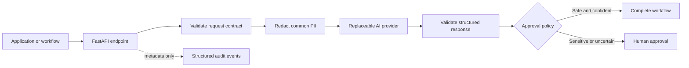

# AI Workflow Integration Starter

[](https://github.com/3QInnova/ai-workflow-integration-starter/actions/workflows/ci.yml)

An original, production-minded Python reference implementation for adding AI assistance to a business workflow without surrendering validation, privacy controls, auditability, or human judgment.

The example accepts a customer-support request, redacts common PII, sends only the sanitized contract across an isolated provider boundary, validates the structured response, applies deterministic approval policy, and emits content-free audit events.

## What this demonstrates

- FastAPI with explicit Pydantic request and response contracts
- Provider abstraction that prevents vendor lock-in
- Local deterministic provider for development and demonstrations
- Generic HTTP/JSON adapter for an enterprise AI gateway
- PII redaction before the external provider boundary
- Schema validation of AI-generated output
- Human approval for sensitive or low-confidence actions
- Correlation IDs and structured audit events
- Environment-based configuration without committed secrets
- Automated tests, container packaging, and GitHub Actions CI

## Architecture



## Safety boundary

AI output is treated as untrusted input. The provider can recommend an action, but code—not the model—decides whether that action may proceed automatically.

This starter requires human approval when:

- an action would change customer funds or account state; or
- provider confidence falls below the configured threshold.

Production deployments should add the controls described in [SECURITY.md](SECURITY.md), including identity, authorization, rate limiting, provider allowlists, secret management, and organization-specific privacy and model-risk review.

## Run locally

Requires Python 3.12 or later.

```bash
python -m venv .venv
source .venv/bin/activate
python -m pip install .
uvicorn app.main:app --reload
```

Open `http://127.0.0.1:8000/docs` for the generated API documentation.

## Example

```bash
curl -X POST http://127.0.0.1:8000/v1/workflows/analyze \
  -H "Content-Type: application/json" \
  -H "X-Correlation-Id: demo-123" \
  -d '{
    "customer_id": "customer-123",
    "message": "Please issue a refund. Contact me at person@example.com.",
    "channel": "web"
  }'
```

The response is marked `pending_approval`, and the provider receives a redacted email address.

## Providers

The default `rules` provider is deterministic and requires no external credentials.

To connect an enterprise AI gateway:

```bash
export AI_PROVIDER=http-json
export AI_API_URL=https://your-gateway.example/v1/analyze
export AI_API_KEY=read-this-from-your-secret-manager
export AI_MODEL=your-approved-model
```

The gateway must return a JSON object matching the `ProviderAnalysis` schema. Keeping this adapter separate makes it straightforward to add an approved vendor SDK, private model endpoint, or organization-specific prompt service.

## Test

```bash
python -m unittest discover -s tests -v
python -m compileall -q app tests
```

## Original public demonstration

This repository contains original demonstration code created for public use by 3QInnova LLC. It does not contain employer, client, or proprietary source code.

## License

MIT

